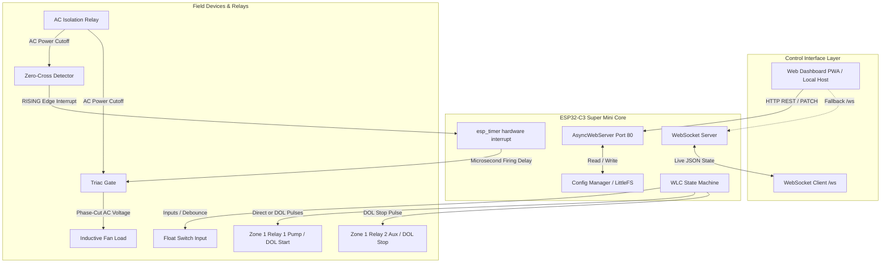

# ZoneCtrl-C3
Compact ESP32-C3 multi-purpose control board
System Architecture Diagram

---

## 1. System Architecture Diagram

---

## 2. Pinout Configuration
3. Pinout Configuration
The controller utilizes abstract Logical Pins in the software API to separate client communication from physical GPIO routing, making modifications to physical board traces straightforward [HardwarePins.h.txt]:
+---------------------------------------------+
       |            ESP32-C3 Super Mini              |
       |                                             |
       |  [GPIO 0] ──> Zone 2 Relay 1 (Logical 2)    |
       |  [GPIO 1] ──> Zone 2 TRIAC Gate (Logical 4) |
       |  [GPIO 2] ──> Zone 2 Relay 2 (Logical 3)    |
       |  [GPIO 3] ──> Zone 1 Relay 2 (Logical 1)    |
       |  [GPIO 4] ──> Zone 1 Relay 1 (Logical 0)    |
       |  [GPIO 5] ──> Dimmer AC Relay  (Logical 5)  |
       |  [GPIO 6] <── Zone 1 Float Switch Input     |
       |  [GPIO 7] <── Zone 2 Zero-Cross Input       |
       |  [GPIO 8] ──> On-Board LED (Active LOW)     |
       +---------------------------------------------+

4. Core Feature Specifications
   A. Zero-Standby Mechanical AC Isolation
Typical TRIAC-based dimmers dissipate continuous passive heat (around 560mW) while the load is turned off, due to snubber circuits and zero-cross sensing resistors.
ZoneCtrl-C3 solves this by placing a mechanical AC isolation relay in series with the mains phase line [main.cpp.txt]. When the fan is off (Speed 0), the relay isolates the zero-cross and TRIAC gate circuit completely, dropping standby draw to absolute zero [main.cpp.txt].
Timing Sequence (Bounce-Resistant Startup)
sequenceDiagram
    autonumber
    actor User as Web Dashboard
    participant Relay as Isolation Relay (GPIO 5)
    participant ZC as ZC Interrupt (GPIO 7)
    participant TRIAC as TRIAC Gate (GPIO 1)

    User->>Relay: Set Speed 1-5 (Master ON)
    activate Relay
    Relay-->>Relay: Energize Relay Coil
    Note over Relay: Mechanical contact bounce occurs
    deactivate Relay
    Note over User, Relay: Blocking delay(25) allows contacts to settle safely
    User->>ZC: Clear noise & attachInterrupt()
    activate ZC
    ZC->>TRIAC: Zero-Cross Rising Edge triggers ISR
    activate TRIAC
    Note over TRIAC: Microsecond-precision phase cutting starts

Turn-Off Sequence (Master OFF / Speed 0):
Instantly detaches the zero-cross interrupt to halt math execution [main.cpp.txt].
Stops active high-resolution hardware timers [main.cpp.txt].
Drops the TRIAC gate pin low [main.cpp.txt].
Drops the AC Isolation Relay low, disconnecting mains voltage from the sensing components [main.cpp.txt].

B. Asynchronous Hardware-Timed Phase-Cutting
Phase-cutting is processed entirely asynchronously inside the ESP-IDF native hardware timer module (esp_timer) to bypass any standard loop() latency [main.cpp.txt].
Zero Loop Jitter: Saving configuration to flash or processing HTTP payloads will never cause your fan to flicker or hum [Project Description].
Raw Microsecond Offsets: No floating-point math is processed in critical paths, maximizing interrupt cycle efficiency [main.cpp.txt].

C. Water Level Controller: Direct vs. DOL Modes
Zone 1 supports dual physical starter configurations, governed by the WLC automation engine [WLC.cpp.txt]:
Direct Drive Mode
Designed for single-phase pumps driven directly by a 30A relay. Relay 1 acts as a static switch; Relay 2 is disabled [WLC.cpp.txt].
[Mains AC] ──> [Relay 1 (COM/NO)] ──> [Pump Motor (Direct Load)]

Direct On-Line (DOL) Starter Mode
Designed for heavy industrial pumps. Uses momentary, non-blocking pulses (1000ms duration) to bridge the starter's start/stop panel [WLC.cpp.txt].
Motor ON Trigger: Momentary 1000ms pulse on Relay 1 (Start) [WLC.cpp.txt].
Motor OFF Trigger: Momentary 1000ms pulse on Relay 2 (Stop) [WLC.cpp.txt].

+-------------------+
                       |    DOL Starter    |
                       |                   |
 [Relay 1 (NO)] ──PULSE──> [Green Start SW] | ──> [Pump Motor]
 [Relay 2 (NC)] ──PULSE──> [Red Stop SW]    |
                       +-------------------+

This is the structured content, diagrams, and AI prompts to create your ZoneCtrl-C3 GitHub documentation page (e.g., README.md).
It includes native GitHub-renderable Mermaid.js diagrams, detailed ASCII-art schematics, and AI generator prompts to produce high-quality diagrams if you prefer to use external design tools.
ZoneCtrl-C3: Dual-Zone Home Automation Controller
ZoneCtrl-C3 is a high-precision, low-standby home automation controller designed for the ESP32-C3 Super Mini platform [Project Description]. It is engineered to handle inductive loads safely, manage direct or Direct On-Line (DOL) water pump starters, and provide zero-standby power isolation for household inductive fans using high-precision hardware timers [Project Description, WLC.cpp.txt].
1. System Architecture Diagram
This diagram shows how the system modules interact asynchronously. (This will render natively as a diagram on GitHub).
code
Mermaid
graph TD
    subgraph Client_Layer [Control Interface Layer]
        PWA[Web Dashboard PWA / Local Host]
        WS[WebSocket Client /ws]
    end

    subgraph Core_ESP32C3 [ESP32-C3 Super Mini Core]
        WebServer[AsyncWebServer Port 80]
        WS_Server[WebSocket Server]
        Config[Config Manager / LittleFS]
        WLC_Eng[WLC State Machine]
        HW_Timer[esp_timer hardware interrupt]
    end

    subgraph Physical_Hardware [Field Devices & Relays]
        Relay_Aux[Zone 1 Relay 2 Aux / DOL Stop]
        Relay_Pump[Zone 1 Relay 1 Pump / DOL Start]
        Float_SW[Float Switch Input]
        ZC_Detect[Zero-Cross Detector]
        Isol_Relay[AC Isolation Relay]
        TRIAC[Triac Gate]
        Fan_Load[Inductive Fan Load]
    end

    PWA -->|HTTP REST / PATCH| WebServer
    PWA -.->|Fallback /ws| WS_Server
    WS_Server <-->|Live JSON State| WS
    WebServer <-->|Read / Write| Config
    
    WLC_Eng -->|Inputs / Debounce| Float_SW
    WLC_Eng -->|Direct or DOL Pulses| Relay_Pump
    WLC_Eng -->|DOL Stop Pulse| Relay_Aux
    
    Isol_Relay -->|AC Power Cutoff| ZC_Detect
    Isol_Relay -->|AC Power Cutoff| TRIAC
    ZC_Detect -->|RISING Edge Interrupt| HW_Timer
    HW_Timer -->|Microsecond Firing Delay| TRIAC
    TRIAC -->|Phase-Cut AC Voltage| Fan_Load
2. Pinout Configuration
The controller utilizes abstract Logical Pins in the software API to separate client communication from physical GPIO routing, making modifications to physical board traces straightforward [HardwarePins.h.txt]:
code
Text
+---------------------------------------------+
       |            ESP32-C3 Super Mini              |
       |                                             |
       |  [GPIO 0] ──> Zone 2 Relay 1 (Logical 2)    |
       |  [GPIO 1] ──> Zone 2 TRIAC Gate (Logical 4) |
       |  [GPIO 2] ──> Zone 2 Relay 2 (Logical 3)    |
       |  [GPIO 3] ──> Zone 1 Relay 2 (Logical 1)    |
       |  [GPIO 4] ──> Zone 1 Relay 1 (Logical 0)    |
       |  [GPIO 5] ──> Dimmer AC Relay  (Logical 5)  |
       |  [GPIO 6] <── Zone 1 Float Switch Input     |
       |  [GPIO 7] <── Zone 2 Zero-Cross Input       |
       |  [GPIO 8] ──> On-Board LED (Active LOW)     |
       +---------------------------------------------+
3. Core Feature Specifications
A. Zero-Standby Mechanical AC Isolation
Typical TRIAC-based dimmers dissipate continuous passive heat (around 560mW) while the load is turned off, due to snubber circuits and zero-cross sensing resistors.
ZoneCtrl-C3 solves this by placing a mechanical AC isolation relay in series with the mains phase line [main.cpp.txt]. When the fan is off (Speed 0), the relay isolates the zero-cross and TRIAC gate circuit completely, dropping standby draw to absolute zero [main.cpp.txt].
Timing Sequence (Bounce-Resistant Startup)
code
Mermaid
sequenceDiagram
    autonumber
    actor User as Web Dashboard
    participant Relay as Isolation Relay (GPIO 5)
    participant ZC as ZC Interrupt (GPIO 7)
    participant TRIAC as TRIAC Gate (GPIO 1)

    User->>Relay: Set Speed 1-5 (Master ON)
    activate Relay
    Relay-->>Relay: Energize Relay Coil
    Note over Relay: Mechanical contact bounce occurs
    deactivate Relay
    Note over User, Relay: Blocking delay(25) allows contacts to settle safely
    User->>ZC: Clear noise & attachInterrupt()
    activate ZC
    ZC->>TRIAC: Zero-Cross Rising Edge triggers ISR
    activate TRIAC
    Note over TRIAC: Microsecond-precision phase cutting starts
Turn-Off Sequence (Master OFF / Speed 0):
Instantly detaches the zero-cross interrupt to halt math execution [main.cpp.txt].
Stops active high-resolution hardware timers [main.cpp.txt].
Drops the TRIAC gate pin low [main.cpp.txt].
Drops the AC Isolation Relay low, disconnecting mains voltage from the sensing components [main.cpp.txt].
B. Asynchronous Hardware-Timed Phase-Cutting
Phase-cutting is processed entirely asynchronously inside the ESP-IDF native hardware timer module (esp_timer) to bypass any standard loop() latency [main.cpp.txt].
Zero Loop Jitter: Saving configuration to flash or processing HTTP payloads will never cause your fan to flicker or hum [Project Description].
Raw Microsecond Offsets: No floating-point math is processed in critical paths, maximizing interrupt cycle efficiency [main.cpp.txt].
C. Water Level Controller: Direct vs. DOL Modes
Zone 1 supports dual physical starter configurations, governed by the WLC automation engine [WLC.cpp.txt]:
Direct Drive Mode
Designed for single-phase pumps driven directly by a 30A relay. Relay 1 acts as a static switch; Relay 2 is disabled [WLC.cpp.txt].
code
Text
[Mains AC] ──> [Relay 1 (COM/NO)] ──> [Pump Motor (Direct Load)]
Direct On-Line (DOL) Starter Mode
Designed for heavy industrial pumps. Uses momentary, non-blocking pulses (1000ms duration) to bridge the starter's start/stop panel [WLC.cpp.txt].
Motor ON Trigger: Momentary 1000ms pulse on Relay 1 (Start) [WLC.cpp.txt].
Motor OFF Trigger: Momentary 1000ms pulse on Relay 2 (Stop) [WLC.cpp.txt].
code
Text
+-------------------+
                       |    DOL Starter    |
                       |                   |
 [Relay 1 (NO)] ──PULSE──> [Green Start SW] | ──> [Pump Motor]
 [Relay 2 (NC)] ──PULSE──> [Red Stop SW]    |
                       +-------------------+
4. Software Design Patterns
Adaptive Web Client
The web client shifts its operating profile dynamically based on the secure context of its loaded origin:
Insecure Context (Local Wi-Fi / Local IP): Operates over relative HTTP REST APIs (/api/status) and WebSockets (/ws). Gives full access to configuration settings.
Secure Context (GitHub Pages / External HTTPS): Adapts to prevent Mixed Content / CORS errors. The app automatically deactivates relative HTTP fetches and exposes a Connect BLE button in the header, letting the user control the physical device via secure Web Bluetooth APIs directly.

